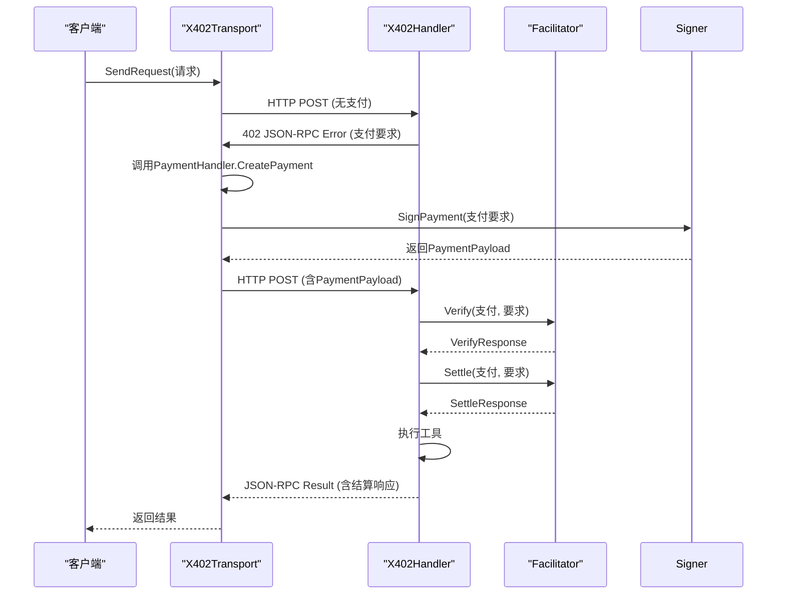

# 核心功能

<cite>
**本文档引用的文件**   
- [transport.go](file://transport.go)
- [server.go](file://server/server.go)
- [handler.go](file://server/handler.go)
- [signer.go](file://signer.go)
- [types.go](file://types.go)
- [client_options.go](file://client_options.go)
</cite>

## 目录
1. [自动支付处理](#自动支付处理)
2. [多网络支持](#多网络支持)
3. [灵活支付策略](#灵活支付策略)
4. [安全签名机制](#安全签名机制)
5. [功能协同工作流程](#功能协同工作流程)

## 自动支付处理

`mcp-go-x402` 的自动支付处理功能通过客户端 `X402Transport` 实现，能够在用户几乎无感知的情况下完成整个支付流程。当客户端请求一个需要付费的工具时，服务器会返回一个 402 状态码（支付所需）的 JSON-RPC 错误响应，其中包含了所有可用的支付选项。`X402Transport` 会自动拦截这个错误，根据配置的 `PaymentSigner` 选择一个合适的支付方案，创建并签名支付授权，然后将签名后的支付数据（`PaymentPayload`）重新注入到原始请求中，并再次发送。一旦支付被服务器验证和结算，工具的执行结果将被返回给用户。整个过程对上层应用是透明的，极大地减少了用户的交互步骤。

**Section sources**
- [transport.go](file://transport.go#L222-L257)
- [transport.go](file://transport.go#L33-L63)

## 多网络支持

`mcp-go-x402` 通过配置化的 `ClientPaymentOption` 实现了对多区块链网络的支持。客户端在初始化 `PaymentSigner`（如 `PrivateKeySigner` 或 `MockSigner`）时，会传入一个或多个 `ClientPaymentOption`。每个 `ClientPaymentOption` 明确指定了支持的网络（如 `base`、`base-sepolia`）、资产（如 USDC 的合约地址）、链 ID（`ChainID`）以及优先级。当服务器返回支付要求时，客户端的支付处理器会根据这些预设选项，选择一个匹配的网络和资产进行支付。例如，`AcceptUSDCBase()` 和 `AcceptUSDCBaseSepolia()` 两个辅助函数分别创建了针对 Base 主网和 Base Sepolia 测试网的支付选项，使得客户端可以无缝地在不同网络间切换。

**Section sources**
- [client_options.go](file://client_options.go#L10-L59)
- [signer.go](file://signer.go#L41-L87)
- [signer.go](file://signer.go#L333-L387)

## 灵活支付策略

服务器端的灵活支付策略通过 `X402Server` 和 `Config` 结构体实现。开发者可以为每个工具（`Tool`）配置一个或多个 `PaymentRequirement`。每个 `PaymentRequirement` 定义了支付的详细信息，包括网络、资产、最大需求数额、收款地址等。`AddPayableTool` 方法允许为一个工具添加多种支付选项，例如，同一个工具可以同时接受在以太坊主网、Base 主网或 Base Sepolia 测试网上的支付，并且可以设置不同的价格（例如，测试网价格更低作为折扣）。这种设计使得服务器能够支持基于工具、用户或上下文的差异化定价，客户端可以根据自身情况（如网络偏好、余额）选择最合适的支付方式。

**Section sources**
- [server.go](file://server/server.go#L50-L69)
- [types.go](file://types.go#L10-L30)

## 安全签名机制

`mcp-go-x402` 的安全签名机制基于 EIP-712 标准，提供了结构化数据签名的优势。私钥保护的最佳实践体现在 `PaymentSigner` 接口的设计上，私钥被封装在实现该接口的结构体（如 `PrivateKeySigner`）内部，不会直接暴露。防重放攻击的 nonce 管理通过在 `SignPayment` 方法中生成一个基于时间戳、资源和地址的 Keccak256 哈希值作为 nonce 来实现。同时，支付授权中包含了 `validAfter` 和 `validBefore` 时间窗口，确保了签名在特定时间段内有效，进一步增强了安全性。签名过程由 `signer.SignPayment` 方法完成，生成符合 EIP-712 格式的 `PaymentPayload`。

**Section sources**
- [signer.go](file://signer.go#L127-L207)
- [signer.go](file://signer.go#L23-L38)

## 功能协同工作流程

`mcp-go-x402` 的核心功能通过 `transport.go` 和 `server.go` 中的组件协同工作，形成一个完整的微支付解决方案。其工作流程如下：客户端使用 `X402Transport` 发起请求。如果请求的工具需要支付，服务器的 `X402Handler` 会拦截请求，检查 `PaymentTools` 配置，若未提供支付，则返回包含 `PaymentRequirementsResponse` 的 402 错误。客户端的 `X402Transport` 收到此错误后，调用其 `PaymentHandler` 的 `CreatePayment` 方法。该方法会根据服务器的要求和客户端的 `PaymentSigner` 配置，选择支付方案并调用 `Signer.SignPayment` 进行 EIP-712 签名，生成 `PaymentPayload`。随后，客户端将 `PaymentPayload` 重新发送给服务器。服务器的 `X402Handler` 验证签名后，通过 `Facilitator` 与后端服务进行交互，完成支付验证和链上结算，最终执行工具并返回结果。

**Diagram sources**
- [transport.go](file://transport.go#L33-L63)
- [server.go](file://server/server.go#L17-L27)
- [handler.go](file://server/handler.go#L15-L19)