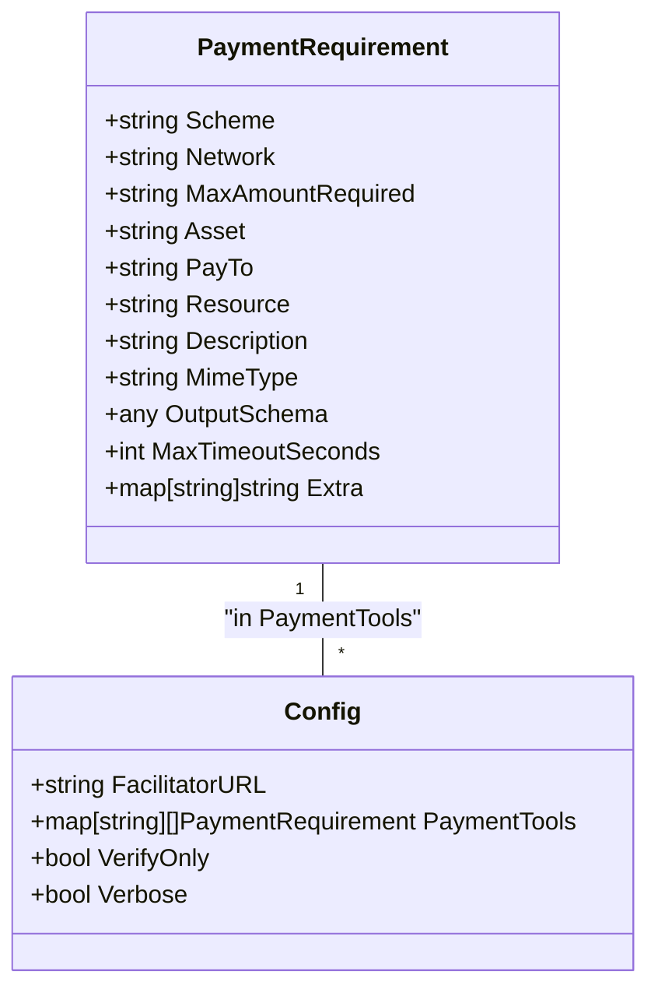
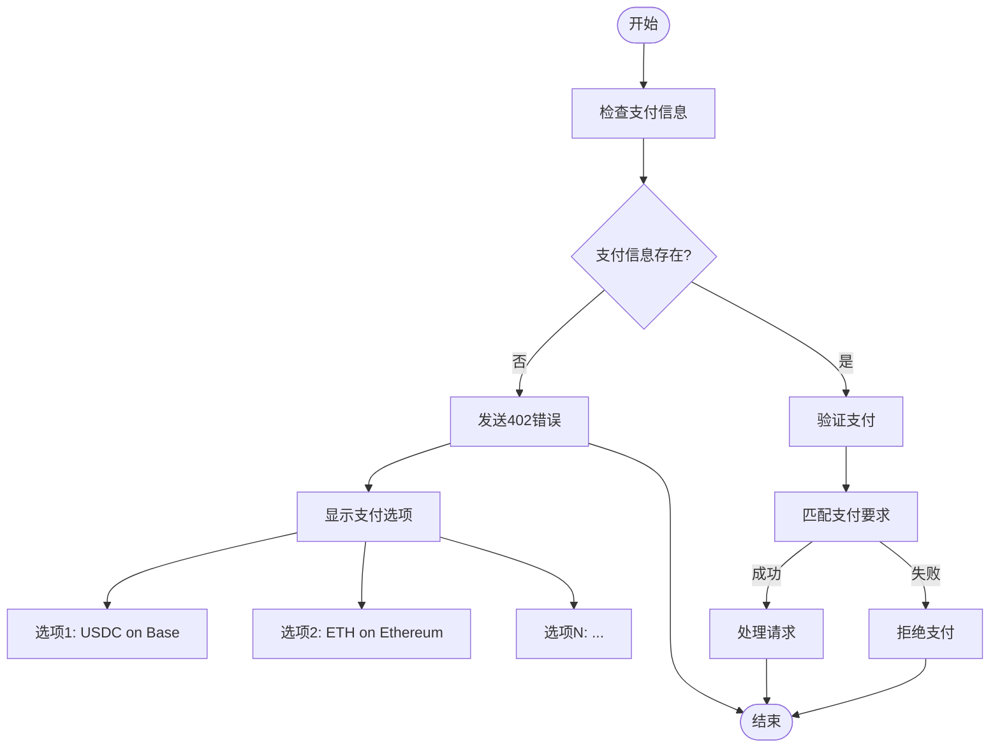
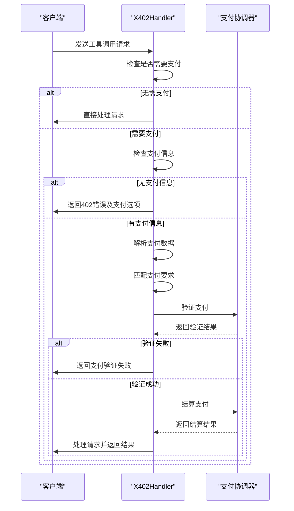
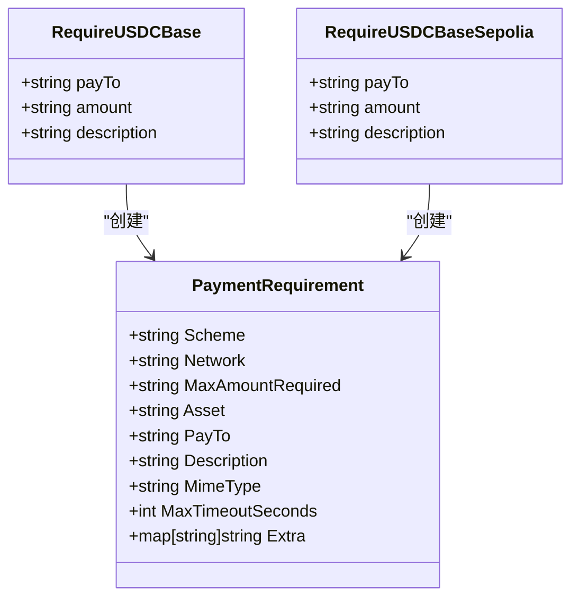
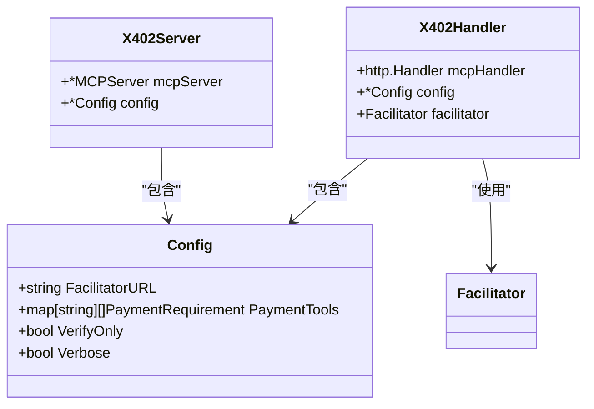

# 灵活支付策略

<cite>
**Referenced Files in This Document**   
- [server/server.go](file://server/server.go)
- [server/types.go](file://server/types.go)
- [server/requirements.go](file://server/requirements.go)
- [server/handler.go](file://server/handler.go)
</cite>

## 目录
1. [简介](#简介)
2. [核心组件](#核心组件)
3. [支付要求配置](#支付要求配置)
4. [多选项支付支持](#多选项支付支持)
5. [支付验证流程](#支付验证流程)
6. [动态支付条件扩展](#动态支付条件扩展)
7. [安全与配置管理](#安全与配置管理)
8. [结论](#结论)

## 简介
本文档全面介绍服务器端灵活定价策略的实现方式。基于`AddPayableTool`方法和`PaymentRequirement`结构，说明如何为不同工具（Tool）配置差异化的支付要求，包括金额、资产、网络和收款地址。分析`Config.PaymentTools`映射表的构建过程及其在支付验证中的作用。展示如何通过多个`PaymentRequirement`实现多选项支付（如支持USDC或ETH支付）。结合实际业务场景，演示基于用户角色或上下文动态设置支付条件的扩展方法，并提供安全验证与配置管理建议。

## 核心组件

本文档分析的核心组件包括支付要求结构、服务器配置、可支付工具注册方法以及支付处理流程。这些组件共同构成了灵活的支付策略系统，支持为不同工具配置差异化的支付条件。

**Section sources**
- [server/types.go](file://server/types.go#L9-L21)
- [server/server.go](file://server/server.go#L35-L53)

## 支付要求配置

`PaymentRequirement`结构定义了资源或工具的支付要求，包含网络、资产、金额、收款地址等关键字段。通过`AddPayableTool`方法，可以将支付要求与特定工具关联，实现灵活的定价策略。

**Diagram sources**
- [server/types.go](file://server/types.go#L9-L21)
- [server/types.go](file://server/types.go#L91-L104)

**Section sources**
- [server/types.go](file://server/types.go#L9-L21)
- [server/types.go](file://server/types.go#L91-L104)

## 多选项支付支持

系统支持为单个工具配置多个支付选项，允许用户选择不同的支付方式。通过在`AddPayableTool`方法中传入多个`PaymentRequirement`参数，可以实现多选项支付功能。

**Diagram sources**
- [server/server.go](file://server/server.go#L35-L53)
- [server/handler.go](file://server/handler.go#L130-L175)

**Section sources**
- [server/server.go](file://server/server.go#L35-L53)
- [server/handler.go](file://server/handler.go#L130-L175)

## 支付验证流程

支付验证流程由`X402Handler`处理，包括支付信息检查、要求匹配、第三方验证和结算等步骤。系统通过`findMatchingRequirement`方法查找匹配的支付要求，并通过`Facilitator`接口与外部服务进行验证和结算。

**Diagram sources**
- [server/handler.go](file://server/handler.go#L130-L175)
- [server/facilitator.go](file://server/facilitator.go#L82-L126)

**Section sources**
- [server/handler.go](file://server/handler.go#L130-L175)
- [server/facilitator.go](file://server/facilitator.go#L82-L126)

## 动态支付条件扩展

通过`RequireUSDCBase`和`RequireUSDCBaseSepolia`等辅助函数，可以方便地创建常见的支付要求。这些函数为特定网络和资产的支付场景提供了标准化的配置方式，支持快速实现动态支付条件。

**Diagram sources**
- [server/requirements.go](file://server/requirements.go#L4-L20)
- [server/types.go](file://server/types.go#L9-L21)

**Section sources**
- [server/requirements.go](file://server/requirements.go#L4-L20)

## 安全与配置管理

系统通过`Config`结构管理支付相关的配置，包括支付协调器URL、支付工具映射表、验证模式和详细日志等。这些配置确保了支付系统的安全性和可维护性。

**Diagram sources**
- [server/types.go](file://server/types.go#L91-L104)
- [server/server.go](file://server/server.go#L11-L14)
- [server/handler.go](file://server/handler.go#L15-L19)

**Section sources**
- [server/types.go](file://server/types.go#L91-L104)
- [server/server.go](file://server/server.go#L11-L14)
- [server/handler.go](file://server/handler.go#L15-L19)

## 结论
本文档详细介绍了服务器端灵活定价策略的实现方式。通过`PaymentRequirement`结构和`AddPayableTool`方法，系统能够为不同工具配置差异化的支付要求。`Config.PaymentTools`映射表的构建和使用，使得支付验证流程更加灵活和可扩展。多选项支付支持和动态支付条件扩展功能，为实际业务场景提供了强大的灵活性。安全验证与配置管理机制确保了支付系统的安全性和可靠性。