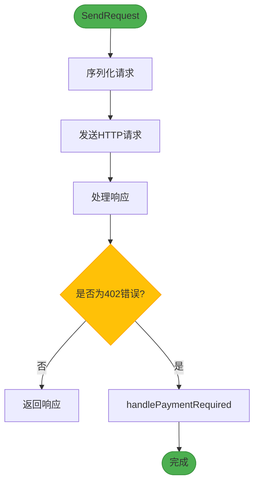
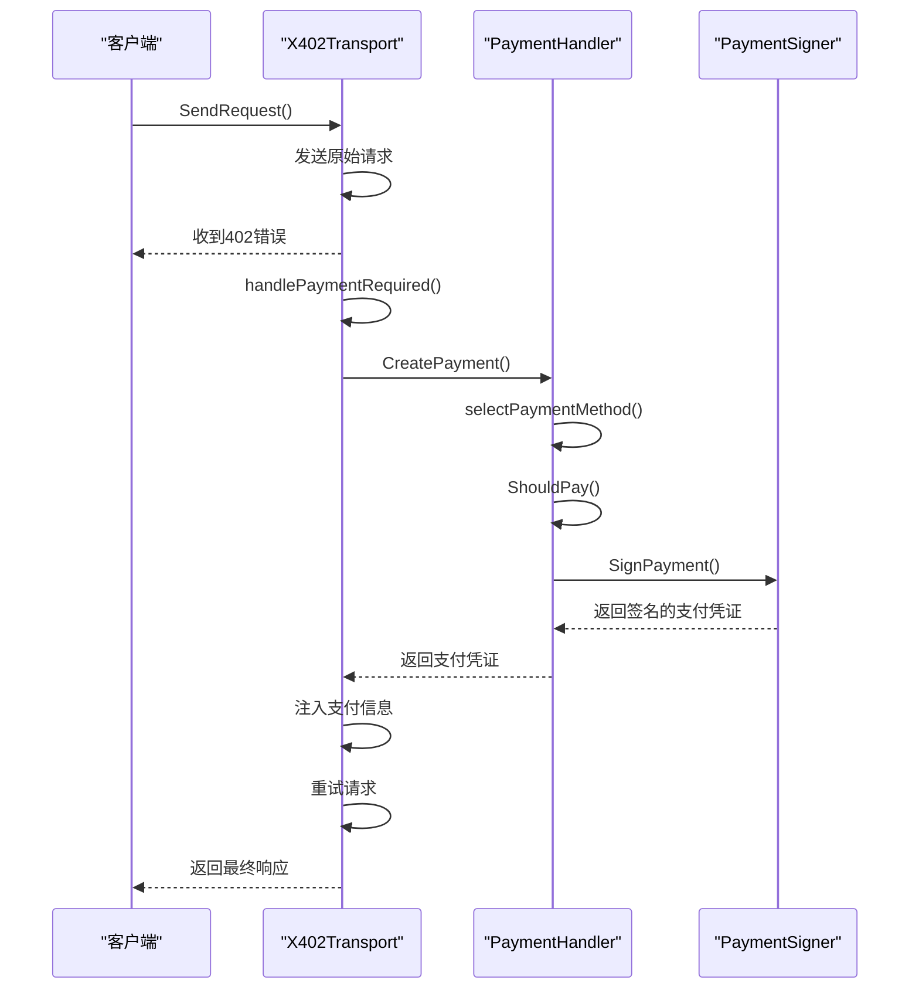
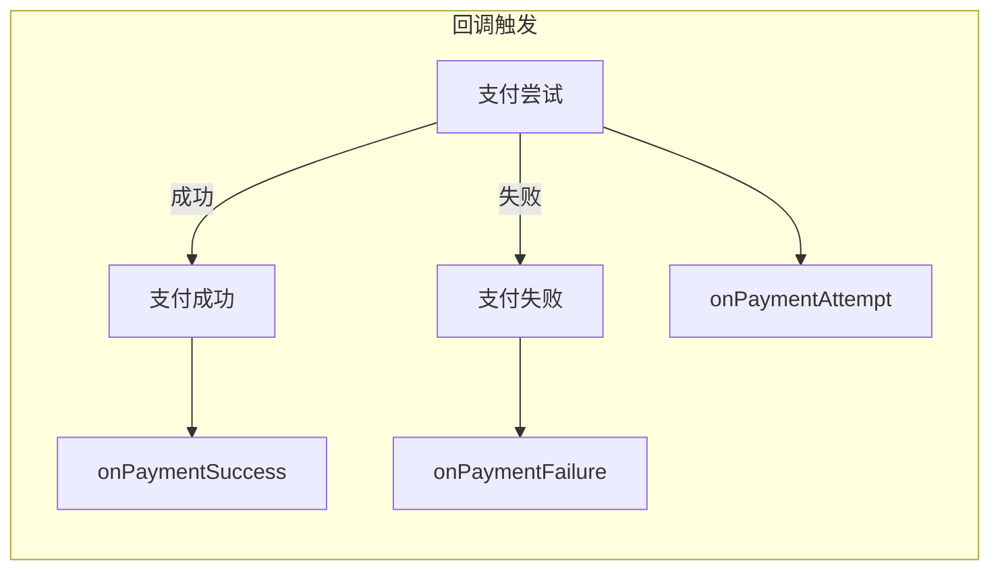
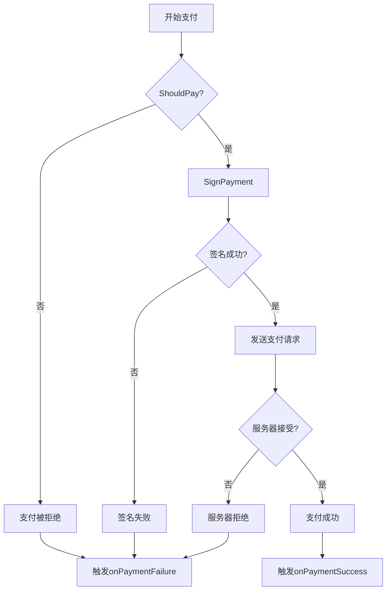
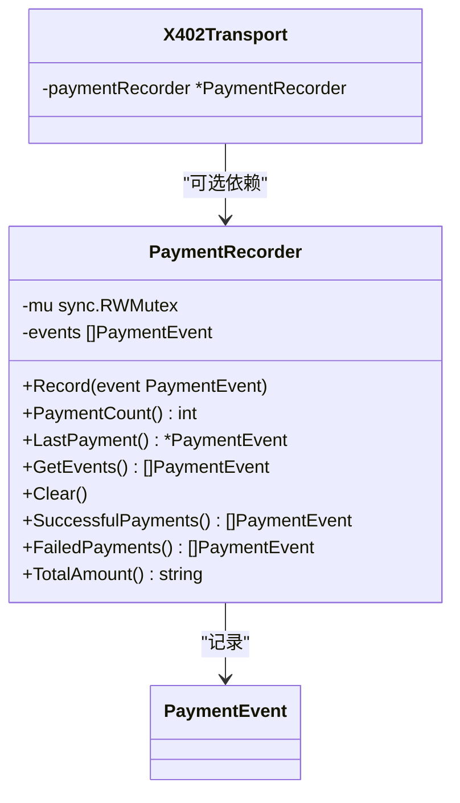

# 自动支付处理

<cite>
**Referenced Files in This Document**   
- [transport.go](file://transport.go)
- [handler.go](file://handler.go)
- [signer.go](file://signer.go)
- [types.go](file://types.go)
- [client_options.go](file://client_options.go)
- [errors.go](file://errors.go)
- [test_utils.go](file://test_utils.go)
- [transport_test.go](file://transport_test.go)
</cite>

## 目录
1. [简介](#简介)
2. [核心组件](#核心组件)
3. [自动支付处理流程](#自动支付处理流程)
4. [支付事件回调机制](#支付事件回调机制)
5. [异常处理策略](#异常处理策略)
6. [支付记录与测试](#支付记录与测试)
7. [集成示例](#集成示例)
8. [总结](#总结)

## 简介
mcp-go-x402客户端实现了无缝的自动支付处理功能，旨在为开发者提供无感的支付体验。该机制通过拦截402支付响应，自动创建并签名支付凭证，并将支付信息注入后续请求中，从而实现对支付流程的完全自动化处理。本文档详细阐述了X402Transport如何与PaymentHandler协同工作，处理JSON-RPC 402错误或HTTP 402状态码，并说明支付事件回调机制的触发时机与使用场景。

## 核心组件

mcp-go-x402的自动支付功能由多个核心组件构成，它们协同工作以实现无缝支付体验。

**Section sources**
- [transport.go](file://transport.go#L33-L63)
- [handler.go](file://handler.go#L10-L13)
- [signer.go](file://signer.go#L24-L31)
- [types.go](file://types.go#L10-L25)

### X402Transport
`X402Transport`是客户端的核心传输层，负责处理所有与服务器的通信。它继承了StreamableHTTP的功能，并在此基础上增加了对x402支付协议的支持。该结构体包含HTTP客户端、支付处理器、会话管理、通知处理以及支付事件回调等关键字段。

### PaymentHandler
`PaymentHandler`是支付处理的核心逻辑组件，负责决定是否进行支付、选择最佳支付方式以及创建支付凭证。它依赖于`PaymentSigner`接口来完成实际的签名操作，并通过`HandlerConfig`配置支付策略。

### PaymentSigner
`PaymentSigner`是一个接口，定义了支付签名器的行为。mcp-go-x402提供了多种实现，包括`PrivateKeySigner`、`MnemonicSigner`、`KeystoreSigner`和用于测试的`MockSigner`。这些实现允许客户端使用不同的密钥管理方式来签署支付授权。

### 支付相关类型
`types.go`文件定义了支付流程中使用的关键数据结构，包括`PaymentRequirement`（支付要求）、`PaymentPayload`（支付凭证）、`SettlementResponse`（结算响应）和`PaymentEvent`（支付事件）等。

```mermaid
classDiagram
class X402Transport {
-serverURL *url.URL
-httpClient *http.Client
-handler *PaymentHandler
-sessionID atomic.Value
-protocolVersion atomic.Value
-initialized chan struct{}
-notificationHandler func(mcp.JSONRPCNotification)
-requestHandler transport.RequestHandler
-onPaymentAttempt func(PaymentEvent)
-onPaymentSuccess func(PaymentEvent)
-onPaymentFailure func(PaymentEvent, error)
-closed chan struct{}
-paymentRecorder *PaymentRecorder
}
class PaymentHandler {
-signer PaymentSigner
-config *HandlerConfig
}
class PaymentSigner {
<<interface>>
+SignPayment(ctx context.Context, req PaymentRequirement) (*PaymentPayload, error)
+GetAddress() string
+SupportsNetwork(network string) bool
+HasAsset(asset, network string) bool
+GetPaymentOption(network, asset string) *ClientPaymentOption
}
class PaymentRequirement {
+Scheme string
+Network string
+MaxAmountRequired string
+Asset string
+PayTo string
+Resource string
+Description string
+MaxTimeoutSeconds int
+Extra map[string]string
}
class PaymentPayload {
+X402Version int
+Scheme string
+Network string
+Payload PaymentPayloadData
}
class PaymentPayloadData {
+Signature string
+Authorization PaymentAuthorization
}
class PaymentAuthorization {
+From string
+To string
+Value string
+ValidAfter string
+ValidBefore string
+Nonce string
}
class SettlementResponse {
+Success bool
+Transaction string
+Network string
+Payer string
+ErrorReason string
}
class PaymentEvent {
+Type PaymentEventType
+Resource string
+Method string
+Amount *big.Int
+Network string
+Asset string
+Recipient string
+Transaction string
+Error error
+Timestamp int64
}
X402Transport --> PaymentHandler : "包含"
PaymentHandler --> PaymentSigner : "依赖"
PaymentHandler --> HandlerConfig : "配置"
PaymentPayload --> PaymentPayloadData : "包含"
PaymentPayloadData --> PaymentAuthorization : "包含"
X402Transport --> PaymentEvent : "触发"
PaymentHandler --> PaymentRequirement : "处理"
PaymentPayload --> SettlementResponse : "响应"
```

**Diagram sources**
- [transport.go](file://transport.go#L33-L63)
- [handler.go](file://handler.go#L10-L13)
- [signer.go](file://signer.go#L24-L31)
- [types.go](file://types.go#L10-L25)

## 自动支付处理流程

mcp-go-x402的自动支付处理流程始于`SendRequest`方法，当收到402错误时，通过`handlePaymentRequired`方法完成支付凭证的创建和重试。

**Section sources**
- [transport.go](file://transport.go#L175-L208)
- [transport.go](file://transport.go#L213-L309)

### SendRequest处理流程
`SendRequest`方法是客户端发起请求的入口点。它首先尝试发送原始请求，如果服务器返回402错误，则触发支付处理流程。



**Diagram sources**
- [transport.go](file://transport.go#L175-L208)

### handlePaymentRequired处理流程
当`SendRequest`检测到402错误时，会调用`handlePaymentRequired`方法。该方法解析支付要求，创建并签名支付凭证，然后根据传输方式（HTTP头或JSON-RPC元数据）将支付信息注入请求中。



**Diagram sources**
- [transport.go](file://transport.go#L213-L309)

## 支付事件回调机制

mcp-go-x402提供了完善的支付事件回调机制，允许开发者监控支付生命周期的各个阶段。

**Section sources**
- [transport.go](file://transport.go#L53-L55)
- [types.go](file://types.go#L70-L81)
- [types.go](file://types.go#L84-L89)

### 支付事件类型
支付事件分为三种类型：
- `PaymentEventAttempt`：支付尝试事件
- `PaymentEventSuccess`：支付成功事件
- `PaymentEventFailure`：支付失败事件

### 回调函数
`X402Transport`支持三个回调函数：
- `onPaymentAttempt`：在支付尝试时触发
- `onPaymentSuccess`：在支付成功时触发
- `onPaymentFailure`：在支付失败时触发



**Diagram sources**
- [transport.go](file://transport.go#L53-L55)

## 异常处理策略

mcp-go-x402实现了全面的异常处理策略，确保在各种错误情况下都能提供清晰的反馈。

**Section sources**
- [errors.go](file://errors.go#L8-L25)
- [handler.go](file://handler.go#L37-L55)
- [transport.go](file://transport.go#L790-L821)

### 支付拒绝处理
当支付被策略拒绝时，`ShouldPay`方法会返回`false`，导致`CreatePayment`失败并触发`onPaymentFailure`回调。

### 签名失败处理
如果签名过程失败，`SignPayment`方法会返回错误，该错误会被捕获并传递给`onPaymentFailure`回调。

### 服务器拒绝支付
即使客户端成功创建了支付凭证，服务器仍可能拒绝支付。在这种情况下，`handlePaymentRequired`会检测到服务器返回的402错误，并返回相应的错误信息。



**Diagram sources**
- [errors.go](file://errors.go#L8-L25)

## 支付记录与测试

mcp-go-x402提供了`PaymentRecorder`工具，用于记录和分析支付事件，特别适用于测试场景。

**Section sources**
- [test_utils.go](file://test_utils.go#L8-L18)
- [transport.go](file://transport.go#L824-L828)

### PaymentRecorder功能
`PaymentRecorder`可以记录所有支付事件，并提供以下查询方法：
- `PaymentCount()`：获取总支付次数
- `LastPayment()`：获取最后一次支付事件
- `SuccessfulPayments()`：获取所有成功支付
- `FailedPayments()`：获取所有失败支付
- `TotalAmount()`：获取成功支付的总金额

### 配置支付记录器
通过`WithPaymentRecorder`选项，可以将`PaymentRecorder`注入到`X402Transport`中。



**Diagram sources**
- [test_utils.go](file://test_utils.go#L8-L18)

## 集成示例

以下是一个完整的集成示例，展示如何使用mcp-go-x402的自动支付功能。

**Section sources**
- [examples/client/main.go](file://examples/client/main.go)

```go
// 创建支付签名器
signer := NewMockSigner("0xTestWallet", AcceptUSDCBaseSepolia())

// 创建支付记录器用于测试
recorder := NewPaymentRecorder()

// 配置X402Transport
config := Config{
    ServerURL: "https://api.example.com",
    Signer:    signer,
    OnPaymentAttempt: func(event PaymentEvent) {
        log.Printf("支付尝试: %s %s", event.Amount.String(), event.Resource)
    },
    OnPaymentSuccess: func(event PaymentEvent) {
        log.Printf("支付成功: %s %s", event.Amount.String(), event.Resource)
    },
    OnPaymentFailure: func(event PaymentEvent, err error) {
        log.Printf("支付失败: %v - %s", err, event.Resource)
    },
}

// 创建传输客户端
transport, err := New(config)
if err != nil {
    log.Fatal(err)
}

// 注入支付记录器
transport.paymentRecorder = recorder

// 发送请求（将自动处理支付）
request := transport.JSONRPCRequest{
    ID:     mcp.NewRequestId(1),
    Method: "test.method",
    Params: json.RawMessage(`{}`),
}

response, err := transport.SendRequest(context.Background(), request)
if err != nil {
    log.Fatal(err)
}

// 分析支付记录
log.Printf("总支付次数: %d", recorder.PaymentCount())
log.Printf("成功支付: %d", len(recorder.SuccessfulPayments()))
log.Printf("失败支付: %d", len(recorder.FailedPayments()))
log.Printf("总支付金额: %s", recorder.TotalAmount())
```

## 总结

mcp-go-x402客户端通过`X402Transport`和`PaymentHandler`的协同工作，实现了无缝的自动支付处理功能。该机制能够自动拦截402支付响应，生成并签名支付凭证，并将支付信息注入后续请求中。通过完善的支付事件回调机制，开发者可以监控支付生命周期的各个阶段。异常处理策略确保了在支付被拒绝或签名失败等情况下的稳健性。`PaymentRecorder`工具为测试和调试提供了强大的支持。整体设计显著降低了开发者的负担，实现了用户无感的支付体验。