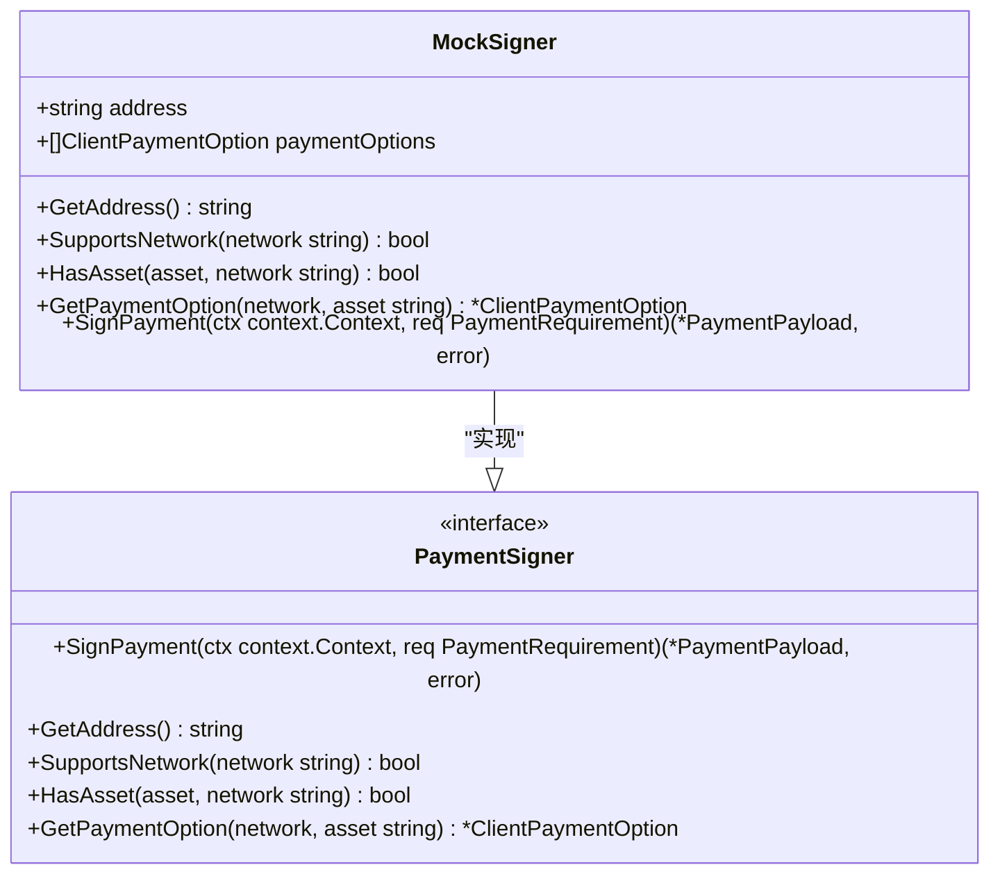
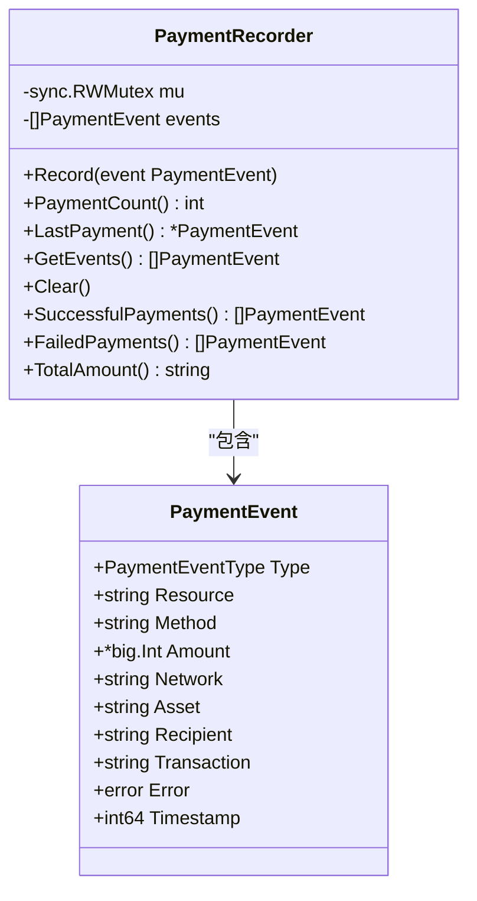
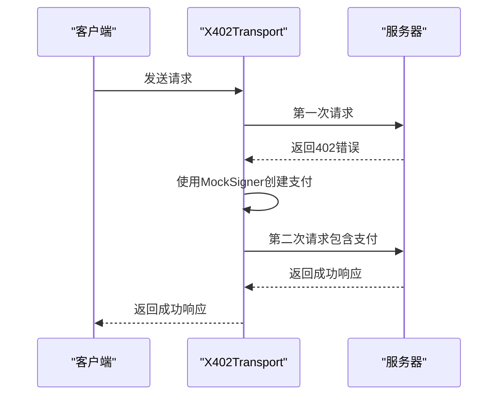
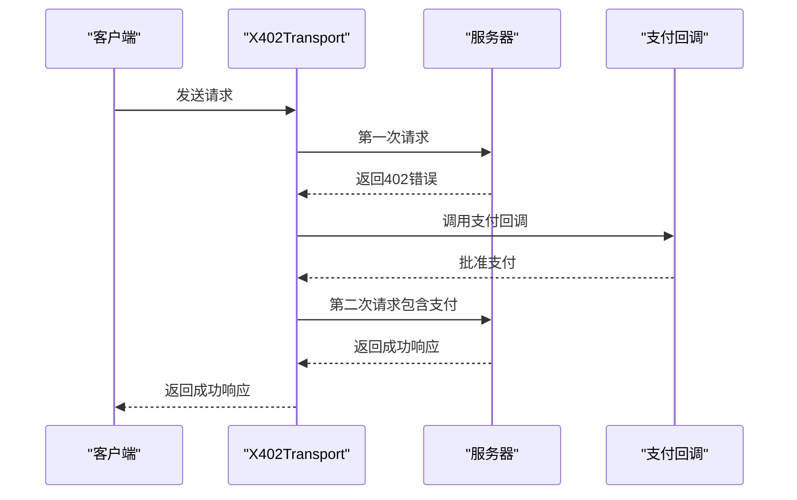
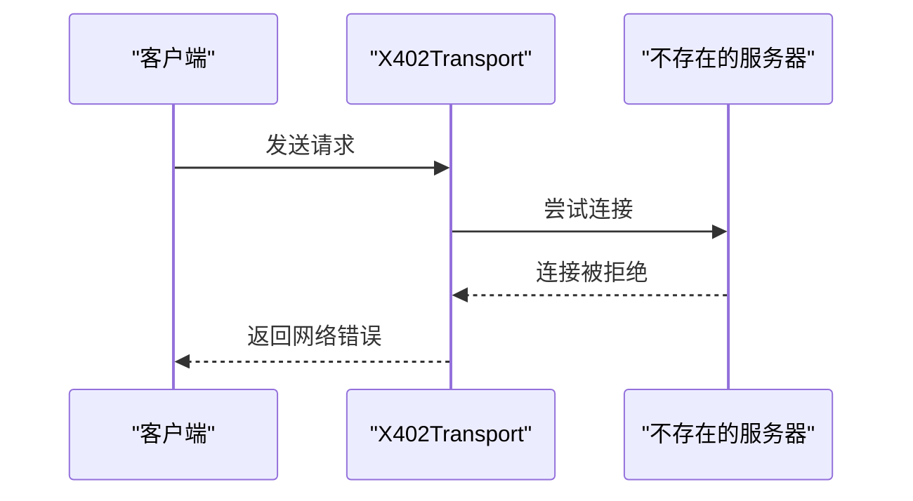

# 测试支持

<cite>
**本文档引用的文件**   
- [signer.go](file://signer.go)
- [test_utils.go](file://test_utils.go)
- [transport_test.go](file://transport_test.go)
- [transport.go](file://transport.go)
- [types.go](file://types.go)
</cite>

## 目录
1. [简介](#简介)
2. [MockSigner 安全测试支持](#mocksigner-安全测试支持)
3. [测试工具与辅助函数](#测试工具与辅助函数)
4. [单元测试案例分析](#单元测试案例分析)
5. [最佳实践指南](#最佳实践指南)
6. [结论](#结论)

## 简介

mcp-go-x402 库为开发者提供了全面的测试支持，旨在确保基于 X402 协议的应用程序在支付逻辑上的正确性和鲁棒性。本文档重点介绍库中提供的测试工具，包括 `MockSigner` 如何在不接触真实私钥的情况下进行安全测试，`test_utils.go` 中的辅助函数如何简化测试流程，以及通过 `transport_test.go` 中的单元测试案例来验证 X402Transport 在各种场景下的行为。这些工具共同构成了一个强大的测试框架，帮助开发者编写可靠的集成测试和端到端测试。

**Section sources**
- [signer.go](file://signer.go#L333-L358)
- [test_utils.go](file://test_utils.go#L8-L18)
- [transport_test.go](file://transport_test.go#L66-L819)

## MockSigner 安全测试支持

`MockSigner` 是 mcp-go-x402 库中为测试目的设计的关键组件。它实现了 `PaymentSigner` 接口，允许开发者在不使用真实私钥的情况下模拟支付签名过程。这对于单元测试和集成测试至关重要，因为它消除了对真实加密资产和私钥管理的需求，从而提高了测试的安全性和可重复性。

### MockSigner 结构与功能

`MockSigner` 结构体包含一个地址字段和一个支付选项列表。它通过 `NewMockSigner` 函数创建，该函数接受一个地址和一系列 `ClientPaymentOption` 作为参数。如果未提供支付选项，`NewMockSigner` 将默认使用 `AcceptUSDCBaseSepolia()` 选项，这为测试提供了一个合理的默认配置。

**Diagram sources **
- [signer.go](file://signer.go#L333-L358)

### 安全测试优势

使用 `MockSigner` 进行测试的主要优势在于其安全性。由于 `MockSigner` 生成的是确定性的假签名，而不是使用真实的私钥进行加密签名，因此即使测试代码泄露，也不会导致资金损失。此外，`MockSigner` 的 `SignPayment` 方法仍然执行了与真实签名器相同的逻辑，例如验证支付金额的有效性和生成时间窗口，这确保了测试环境尽可能接近生产环境。

**Section sources**
- [signer.go](file://signer.go#L392-L432)

## 测试工具与辅助函数

mcp-go-x402 库通过 `test_utils.go` 文件提供了一系列辅助函数，以简化测试过程并提高测试的可观察性。这些工具帮助开发者记录支付事件、验证支付逻辑，并确保测试的准确性。

### PaymentRecorder 支付事件记录器

`PaymentRecorder` 是一个线程安全的结构体，用于记录支付生命周期中的各种事件，如支付尝试、成功支付和支付失败。它通过 `NewPaymentRecorder` 函数创建，并提供了一系列方法来记录和查询支付事件。

**Diagram sources **
- [test_utils.go](file://test_utils.go#L8-L11)

`PaymentRecorder` 的主要方法包括：
- `Record(event PaymentEvent)`: 记录一个支付事件。
- `PaymentCount()`: 返回记录的支付事件总数。
- `LastPayment()`: 返回最近一次的支付事件。
- `GetEvents()`: 返回所有记录的支付事件。
- `Clear()`: 清除所有记录的支付事件。
- `SuccessfulPayments()`: 返回所有成功的支付事件。
- `FailedPayments()`: 返回所有失败的支付事件。
- `TotalAmount()`: 返回所有成功支付的总金额。

这些方法使得开发者可以轻松地验证支付逻辑的正确性，例如检查是否成功记录了支付尝试和成功支付事件。

**Section sources**
- [test_utils.go](file://test_utils.go#L14-L102)

## 单元测试案例分析

`transport_test.go` 文件包含了多个单元测试案例，这些案例验证了 `X402Transport` 在各种场景下的行为。通过分析这些测试案例，我们可以深入了解如何编写有效的测试来覆盖不同的支付场景。

### 基本支付流程测试

`TestX402Transport_Basic` 测试案例验证了基本的支付流程。它模拟了一个服务器，该服务器在第一次请求时返回 402 错误，要求支付。然后，`X402Transport` 使用 `MockSigner` 创建支付并重试请求，最终服务器返回成功响应。此测试验证了 `X402Transport` 能够正确处理 402 错误并自动完成支付流程。

**Diagram sources **
- [transport_test.go](file://transport_test.go#L66-L156)

### 支付回调测试

`TestX402Transport_PaymentCallback` 测试案例验证了支付回调功能。它设置了一个支付回调函数，该函数在支付前被调用，允许开发者根据支付金额和资源决定是否批准支付。此测试确保了支付回调机制的正确性，这对于实现自定义支付策略至关重要。

**Diagram sources **
- [transport_test.go](file://transport_test.go#L213-L279)

### 网络错误测试

`TestX402Transport_NonExistentServer` 测试案例验证了 `X402Transport` 在面对网络错误时的行为。它尝试连接到一个不存在的服务器，并验证是否正确返回了网络错误。此测试确保了 `X402Transport` 能够优雅地处理网络连接问题。

**Diagram sources **
- [transport_test.go](file://transport_test.go#L477-L499)

**Section sources**
- [transport_test.go](file://transport_test.go#L66-L819)

## 最佳实践指南

为了确保使用 mcp-go-x402 库的应用程序的支付逻辑正确且鲁棒，以下是一些最佳实践指南。

### 使用 MockSigner 进行单元测试

在单元测试中，始终使用 `MockSigner` 来模拟支付签名过程。这不仅可以提高测试的安全性，还可以确保测试的可重复性。通过配置不同的支付选项，可以测试各种支付场景。

### 利用 PaymentRecorder 验证支付逻辑

在集成测试中，使用 `PaymentRecorder` 来记录和验证支付事件。这有助于确保支付逻辑按预期工作，并且可以轻松地调试支付相关的问题。

### 覆盖各种支付场景

编写测试时，应覆盖各种支付场景，包括成功支付、支付失败（如金额超出限制）和网络错误。这有助于确保应用程序在各种情况下都能正确处理支付。

### 使用支付回调进行自定义策略

利用支付回调功能实现自定义支付策略。例如，可以根据支付金额、资源类型或用户身份决定是否批准支付。这为应用程序提供了更大的灵活性和控制力。

## 结论

mcp-go-x402 库通过 `MockSigner`、`PaymentRecorder` 和丰富的单元测试案例，为开发者提供了强大的测试支持。这些工具不仅提高了测试的安全性和可重复性，还帮助开发者编写可靠的集成测试和端到端测试，确保支付逻辑的正确性和鲁棒性。遵循最佳实践指南，开发者可以充分利用这些工具，构建高质量的基于 X402 协议的应用程序。