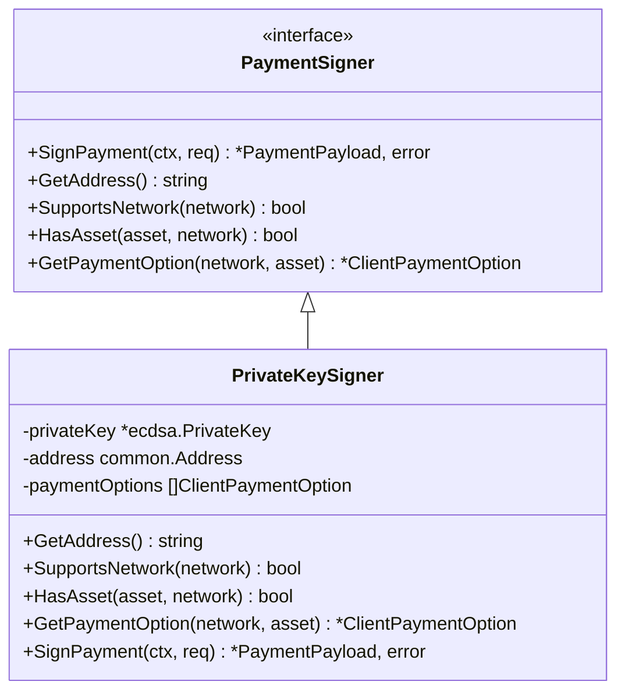
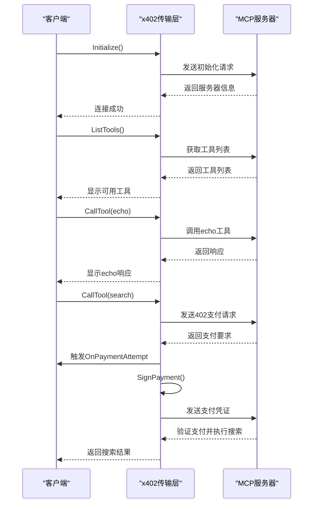
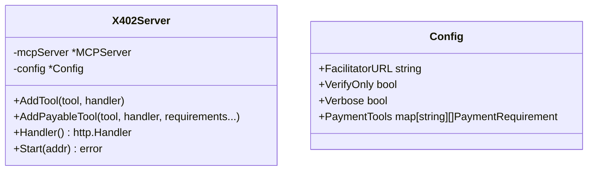

# 示例

<cite>
**Referenced Files in This Document**   
- [examples/client/main.go](file://examples/client/main.go)
- [examples/server/main.go](file://examples/server/main.go)
- [signer.go](file://signer.go)
- [client_options.go](file://client_options.go)
- [server/server.go](file://server/server.go)
- [server/requirements.go](file://server/requirements.go)
</cite>

## Table of Contents
1. [客户端使用教程](#客户端使用教程)
2. [服务器端配置指南](#服务器端配置指南)
3. [变体示例](#变体示例)
4. [常见错误与解决方案](#常见错误与解决方案)

## 客户端使用教程

本教程将详细解释 `examples/client/main.go` 中的代码，指导您如何从创建签名器到成功发起MCP请求的完整流程。

**Section sources**
- [examples/client/main.go](file://examples/client/main.go#L1-L177)

### 步骤 1: 解析命令行参数
程序首先定义并解析命令行参数，包括私钥、服务器URL、网络类型和详细输出模式。私钥可以通过 `-key` 参数或 `WALLET_PRIVATE_KEY` 环境变量提供。

### 步骤 2: 创建支付签名器
根据指定的网络（主网或测试网），程序使用 `NewPrivateKeySigner` 函数创建一个 `PaymentSigner` 实例。该签名器配置了相应的支付选项，例如在主网上接受USDC代币。



**Diagram sources**
- [signer.go](file://signer.go#L15-L433)

### 步骤 3: 配置并初始化传输层
创建 `x402.Config` 实例，将签名器和服务器URL等配置信息注入。可选地，可以设置支付尝试、成功和失败时的回调函数以实现详细日志记录。

### 步骤 4: 发起MCP请求
使用配置好的传输层创建MCP客户端，并依次执行以下操作：
1. 调用 `Initialize` 方法与服务器建立连接。
2. 调用 `ListTools` 方法获取服务器提供的所有可用工具。
3. 调用 `CallTool` 方法，先免费调用 `echo` 工具，再调用需要支付的 `search` 工具。



**Diagram sources**
- [examples/client/main.go](file://examples/client/main.go#L100-L177)
- [server/handler.go](file://server/handler.go)

## 服务器端配置指南

本指南将说明如何基于 `examples/server/main.go` 初始化服务器、注册工具并启动服务。

**Section sources**
- [examples/server/main.go](file://examples/server/main.go#L1-L167)

### 步骤 1: 配置服务器参数
程序首先解析命令行参数，包括监听端口、支付接收地址和是否启用测试网选项。`-pay-to` 参数是必需的，用于指定接收支付的钱包地址。

### 步骤 2: 创建并配置x402服务器
使用 `NewX402Server` 函数创建服务器实例，并传入名称、版本和配置。配置中包含x402协调器的URL和是否仅验证支付的模式。



**Diagram sources**
- [server/server.go](file://server/server.go#L17-L70)

### 步骤 3: 注册工具
使用 `AddTool` 方法注册免费工具（如 `echo`），使用 `AddPayableTool` 方法注册付费工具（如 `search`）。对于付费工具，需要通过 `RequireUSDCBase` 等函数指定支付要求。

### 步骤 4: 启动服务器
调用 `Start` 方法在指定端口上启动HTTP服务器。服务器将监听来自客户端的MCP请求，并根据工具的支付要求处理支付流程。

## 变体示例

### 使用助记词进行签名
除了私钥，您还可以使用助记词创建签名器。这通过 `NewMnemonicSigner` 函数实现，它接受一个BIP-39标准的助记词短语和一个可选的派生路径。

```go
signer, err := x402.NewMnemonicSigner(
    "your twelve word mnemonic phrase here",
    "m/44'/60'/0'/0/0", // 可选：自定义派生路径
    x402.AcceptUSDCBaseSepolia(),
)
```

**Section sources**
- [signer.go](file://signer.go#L300-L330)

### 配置服务器支持多种支付货币
服务器可以配置为接受多种支付货币。例如，可以为同一个工具注册多个支付要求，允许客户端选择使用主网或测试网的USDC进行支付。

```go
srv.AddPayableTool(
    searchTool,
    searchHandler,
    x402server.RequireUSDCBase(payTo, "10000", "Premium search on Base"),
    x402server.RequireUSDCBaseSepolia(payTo, "1000", "Test search on Base Sepolia"),
)
```

**Section sources**
- [server/requirements.go](file://server/requirements.go#L5-L38)

## 常见错误与解决方案

### 错误：私钥未提供
**现象**：程序报错 "Private key required"。
**解决方案**：确保通过 `-key` 命令行参数或 `WALLET_PRIVATE_KEY` 环境变量提供了有效的十六进制格式私钥。

### 错误：支付接收地址未指定
**现象**：服务器启动失败，提示 "-pay-to flag is required"。
**解决方案**：启动服务器时必须使用 `-pay-to` 参数指定一个有效的钱包地址来接收支付。

### 错误：网络连接失败
**现象**：客户端无法连接到服务器。
**解决方案**：检查服务器是否已在指定端口上运行，并确保客户端的 `-server` URL与服务器地址匹配。

**Section sources**
- [examples/client/main.go](file://examples/client/main.go#L30-L40)
- [examples/server/main.go](file://examples/server/main.go#L20-L25)