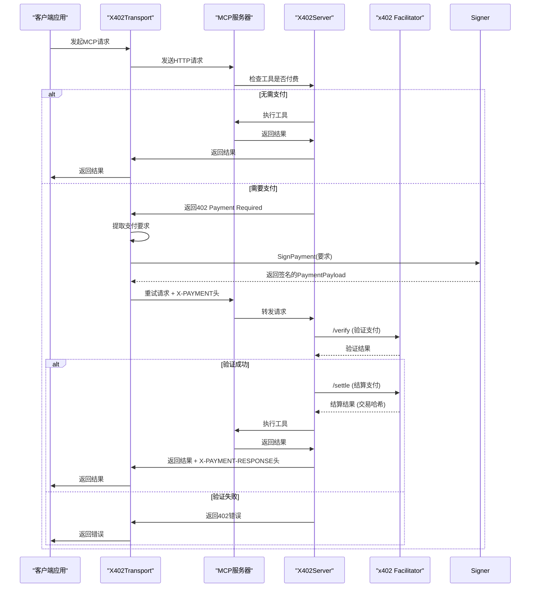
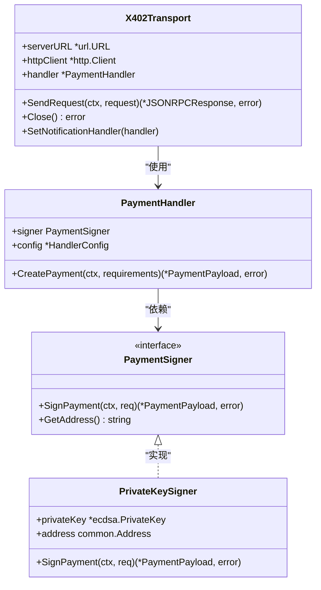
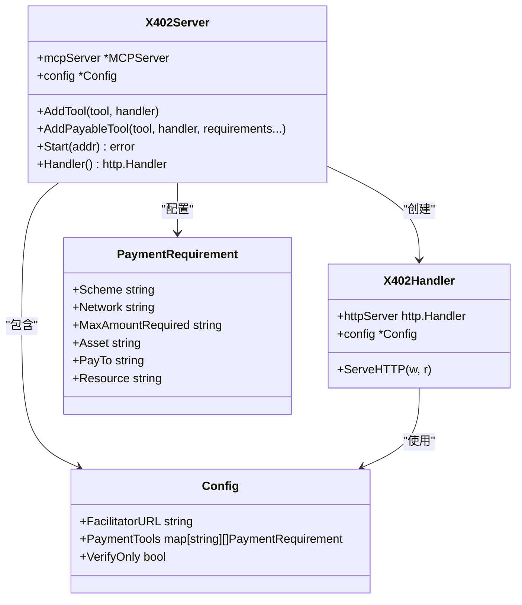
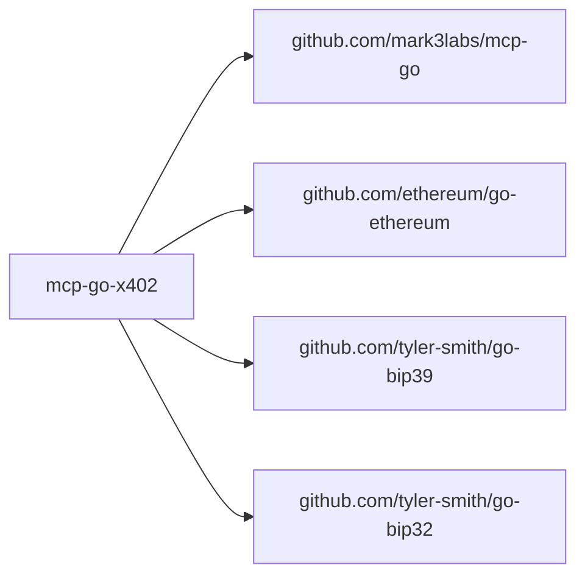

# 项目概述

<cite>
**本文档中引用的文件**  
- [README.md](file://README.md)
- [AGENTS.md](file://AGENTS.md)
- [transport.go](file://transport.go)
- [server/server.go](file://server/server.go)
- [signer.go](file://signer.go)
- [types.go](file://types.go)
- [server/types.go](file://server/types.go)
- [examples/client/main.go](file://examples/client/main.go)
- [examples/server/main.go](file://examples/server/main.go)
</cite>

## 目录
1. [引言](#引言)
2. [项目结构](#项目结构)
3. [核心组件](#核心组件)
4. [架构概览](#架构概览)
5. [详细组件分析](#详细组件分析)
6. [依赖分析](#依赖分析)
7. [性能考虑](#性能考虑)
8. [故障排除指南](#故障排除指南)
9. [结论](#结论)

## 引言
mcp-go-x402 是一个为 MCP-Go 生态系统提供 x402 支付协议支持的 Go 语言库。该项目旨在简化基于区块链的微支付系统在 MCP（Model Context Protocol）应用中的集成，使开发者能够轻松实现客户端自动处理 402 支付响应和服务器端支付验证与结算。其设计目标包括：简化微支付集成、提供灵活的定价策略、确保安全的 EIP-712 签名机制。本项目通过客户端传输层（X402Transport）和服务器包装器（X402Server）的协同工作，实现了无缝的支付体验。它不仅支持主流的以太坊兼容网络（如 Base 主网和 Sepolia 测试网），还通过模块化设计支持多种钱包签名方式（私钥、助记词、Keystore 文件），并为测试提供了模拟签名器。通过阅读本文档，初学者将理解 x402 协议的基本原理和 MCP 框架，而高级用户则能洞察其技术决策背后的权衡，例如为何选择装饰器模式来包装传输层。

## 项目结构
mcp-go-x402 项目采用清晰的分层结构，将客户端和服务器端的逻辑分离，同时共享核心类型定义。根目录包含客户端核心逻辑（如 `transport.go` 和 `signer.go`），而 `server` 子目录则封装了服务器端的支付处理逻辑。`examples` 目录提供了开箱即用的客户端和服务器示例，是学习项目用法的最佳起点。`README.md` 提供了详尽的安装、配置和使用指南，而 `AGENTS.md` 则包含针对 AI 助手的开发规范。这种结构使得代码职责分明，易于维护和扩展。

```mermaid
graph TB
subgraph "根目录"
transport[transport.go<br>客户端传输层]
signer[signer.go<br>签名器实现]
types[types.go<br>核心类型]
client_options[client_options.go<br>客户端选项]
end
subgraph "server"
server[server.go<br>服务器包装器]
handler[handler.go<br>HTTP处理器]
server_types[types.go<br>服务器类型]
facilitator[facilitator.go<br>支付验证]
end
subgraph "examples"
client_example[client/main.go]
server_example[server/main.go]
end
transport --> types
signer --> types
server --> server_types
handler --> server_types
client_example --> transport
server_example --> server
```

**Diagram sources**
- [transport.go](file://transport.go)
- [server/server.go](file://server/server.go)
- [types.go](file://types.go)
- [server/types.go](file://server/types.go)

**Section sources**
- [README.md](file://README.md#L0-L486)
- [project_structure](file://project_structure)

## 核心组件
mcp-go-x402 的核心功能由两个主要组件驱动：客户端的 `X402Transport` 和服务器端的 `X402Server`。`X402Transport` 实现了 MCP-Go 客户端的传输接口，作为现有传输层的“即插即用”替代品，它能自动拦截服务器返回的 402 支付要求，使用配置的 `PaymentSigner` 创建并签名支付授权，然后重试请求。`X402Server` 则是一个包装器，它将标准的 MCP 服务器包装起来，为其添加支付能力。当收到对付费工具的请求时，它会检查支付状态，若无有效支付，则返回 402 响应；若收到支付，则通过 x402 协议指定的“facilitator”服务进行验证和结算。`PaymentSigner` 接口是安全性的基石，它抽象了签名过程，支持多种密钥管理方案，确保私钥不会在库的内部逻辑中暴露。

**Section sources**
- [transport.go](file://transport.go#L33-L63)
- [server/server.go](file://server/server.go#L11-L14)
- [signer.go](file://signer.go#L23-L38)

## 架构概览
mcp-go-x402 的架构遵循清晰的客户端-服务器交互模型。客户端通过 `X402Transport` 发起 MCP 请求。如果服务器上的工具是付费的且请求未附带支付，服务器会返回 HTTP 402 状态码及支付要求。`X402Transport` 捕获此错误，利用 `PaymentSigner` 根据要求生成 EIP-712 签名的支付授权，并将其作为 `X-PAYMENT` 头部或 JSON-RPC 参数重新发送请求。服务器端的 `X402Handler` 接收到带支付的请求后，会调用 `facilitator` 服务验证签名的有效性、金额和时效性。验证通过后，`facilitator` 会执行链上结算（除非处于 `verifyOnly` 模式），并向客户端返回包含交易哈希的 `X-PAYMENT-RESPONSE` 头部，最后执行工具并返回结果。



**Diagram sources**
- [README.md](file://README.md#L290-L314)
- [transport.go](file://transport.go#L33-L63)
- [server/server.go](file://server/server.go#L11-L14)
- [server/handler.go](file://server/handler.go)

## 详细组件分析

### 客户端传输层 (X402Transport) 分析
`X402Transport` 是客户端功能的核心，它通过实现 `transport.Interface` 接口，无缝集成到 MCP-Go 客户端中。其设计巧妙地采用了装饰器模式，包装了底层的 HTTP 通信，从而在不改变客户端主逻辑的情况下注入了支付处理能力。当 `SendRequest` 方法检测到 402 错误时，它会调用 `PaymentHandler` 来创建支付。`PaymentHandler` 会根据配置的 `PaymentSigner` 和支付要求生成 `PaymentPayload`。该组件还支持丰富的回调函数（`OnPaymentAttempt`, `OnPaymentSuccess`, `OnPaymentFailure`），允许应用层监控支付流程，这对于实现用户确认或日志记录至关重要。



**Diagram sources**
- [transport.go](file://transport.go#L33-L63)
- [signer.go](file://signer.go#L23-L38)
- [handler.go](file://handler.go)

**Section sources**
- [transport.go](file://transport.go#L77-L114)
- [signer.go](file://signer.go#L23-L38)

### 服务器包装器 (X402Server) 分析
`X402Server` 组件通过包装现有的 MCP 服务器来提供支付功能，这体现了高内聚、低耦合的设计原则。它本身不处理 HTTP 请求，而是创建一个 `X402Handler`，该处理器可以作为标准的 `http.Handler` 使用。`AddPayableTool` 方法允许为特定工具配置一个或多个 `PaymentRequirement`，这支持了灵活的定价策略，例如为不同网络（主网/测试网）设置不同价格。服务器的配置（`Config`）中包含了 `FacilitatorURL`，这是与外部服务交互的关键，用于验证和结算支付。`VerifyOnly` 模式是一个重要的安全特性，允许在测试环境中验证支付逻辑而不产生实际的链上交易。



**Diagram sources**
- [server/server.go](file://server/server.go#L11-L14)
- [server/types.go](file://server/types.go#L72-L105)
- [server/handler.go](file://server/handler.go)

**Section sources**
- [server/server.go](file://server/server.go#L17-L27)
- [server/types.go](file://server/types.go#L72-L105)

### x402协议与MCP框架基础
x402 协议是一种基于 HTTP 402 状态码的微支付协议，它允许服务器在客户端请求资源时要求支付。该协议的核心是使用 EIP-712 标准对支付授权进行结构化签名，这比简单的消息签名更安全，能防止重放攻击和跨应用签名混淆。MCP（Model Context Protocol）是一个用于 AI 模型与外部工具交互的协议。mcp-go-x402 将两者结合，使得 MCP 工具的调用可以成为一种可货币化的服务。客户端通过 `X402Transport` 透明地处理支付，而服务器通过 `X402Server` 安全地验证和结算，从而在 AI 生态中构建了一个去中心化的经济模型。

**Section sources**
- [README.md](file://README.md#L290-L314)
- [AGENTS.md](file://AGENTS.md#L0-L17)

## 依赖分析
mcp-go-x402 项目依赖于几个关键的外部库来实现其功能。它直接依赖于 `github.com/mark3labs/mcp-go` 来与 MCP 协议交互，这是其存在的基础。为了处理以太坊相关的加密操作，它使用了 `github.com/ethereum/go-ethereum` 库，特别是其 `crypto` 和 `signer/core/apitypes` 包来实现 EIP-712 签名。对于基于助记词的钱包支持，它依赖于 `github.com/tyler-smith/go-bip39` 和 `github.com/tyler-smith/go-bip32`。这些依赖关系清晰地划分了职责：mcp-go 处理协议通信，go-ethereum 处理区块链安全，而本项目则专注于将两者通过 x402 协议桥接起来。



**Diagram sources**
- [go.mod](file://go.mod)
- [signer.go](file://signer.go)

**Section sources**
- [go.mod](file://go.mod#L1-L10)

## 性能考虑
从代码分析来看，mcp-go-x402 的性能瓶颈主要在于网络 I/O 和外部服务调用。每次支付都需要与 `facilitator` 服务进行至少一次（验证）甚至两次（验证+结算）的网络往返，这会增加请求的延迟。然而，这种设计是必要的，以确保支付的安全性和原子性。库本身在客户端和服务器端的处理逻辑都是轻量级的，主要涉及 JSON 序列化/反序列化和签名计算，这些操作在现代硬件上开销很小。为了优化性能，建议在服务器端缓存频繁访问的免费工具结果，并在客户端使用连接池来复用 HTTP 连接。`verifyOnly` 模式在生产环境中应禁用，以避免不必要的链上结算成本。

## 故障排除指南
常见的问题通常与配置错误或网络问题有关。如果客户端无法支付，请检查 `PaymentSigner` 是否配置了正确的网络和资产，并确认钱包地址有足够的余额。如果服务器返回 402 错误但客户端未处理，确保 `X402Transport` 已正确配置并被 MCP 客户端使用。如果支付验证失败，请检查 `FacilitatorURL` 是否正确，并确认 `PaymentRequirement` 中的 `chainId` 与签名时使用的网络匹配。使用 `OnPaymentFailure` 回调可以捕获详细的错误信息。在开发时，使用 `NewMockSigner` 和 `WithPaymentRecorder` 可以方便地测试支付流程而无需真实钱包。

**Section sources**
- [errors.go](file://errors.go)
- [signer_test.go](file://signer_test.go)
- [transport_test.go](file://transport_test.go)

## 结论
mcp-go-x402 是一个设计精良、功能完整的 x402 支付协议实现库。它成功地将复杂的区块链支付逻辑封装在简洁的 API 之下，极大地降低了在 MCP 应用中集成微支付的门槛。其模块化架构、对多种签名方式的支持以及详尽的文档和示例，使其成为一个强大且易于使用的工具。通过采用装饰器模式，它实现了对现有 MCP 客户端和服务器的非侵入式增强。该项目不仅促进了 MCP 生态内的价值流动，也为构建去中心化的 AI 服务市场提供了坚实的技术基础。对于希望将其 AI 工具货币化的开发者来说，mcp-go-x402 是一个理想的选择。